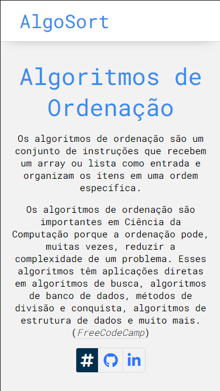

# AlgoSort

## Sobre

O projeto "AlgoSort" é uma página interativa desenvolvida com HTML, CSS e JavaScript, com o objetivo de explicar o funcionamento de diversos algoritmos de ordenação de forma didática e exibir a ordenação de elementos em tempo real. A plataforma é projetada para ser uma ferramenta educativa e prática, adequada para estudantes, entusiastas da ciência da computação e qualquer pessoa interessada em aprender sobre algoritmos de ordenação.

## Aprendizado

Com o desenvolvimento desse projeto, pude aprender mais sobre os diferentes Algoritmos de Ordenação, praticar a manipulação do DOM e ordenar elementos na página. Também aprendi a utilizar Promises para interromper o funcionamento do código e garantir a visualização das animações.

## Features

- Mostrar animações da ordenação de elementos através dos seguintes algoritmos:
  - Bubble Sort
  - Insert Sort
  - Selection Sort
  - Quick Sort
  - Merge Sort

## Layout

## Links

- LinkedIn: https://www.linkedin.com/in/gabrielayresdev/
- Repositório: https://github.com/gabrielayresdev/AlgoSort
  - Caso encontre algum bug e deseje reportar, favor, enviar email para gabriel.ar.fort@gmail.com.
- Deploy: https://algosort-gabrielayresdev.netlify.app/src/index.html
